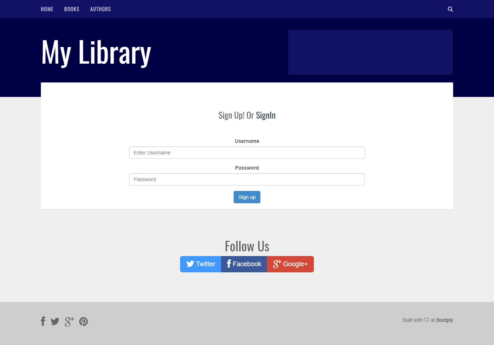
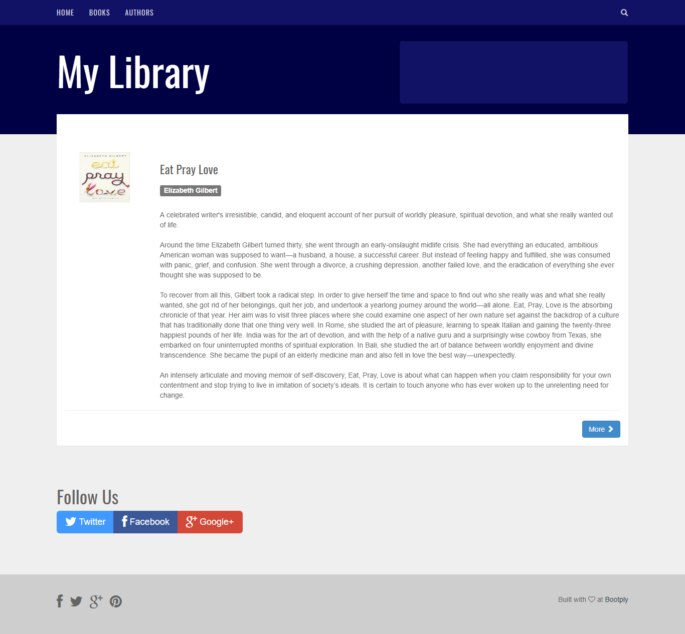

#### LibraryApp

##### This Project is created with NodeJs,MongodDb and authentiaction is done by Passport Js

> Use this as a boilerplate for Authentication of Local Strategies in Passport. 
> GoodRead's Api are used to fetchbooks information.
> Bootstrap template is used in frontend.
> This is a basic project for testing local strategy of passport with express.route
 

 

